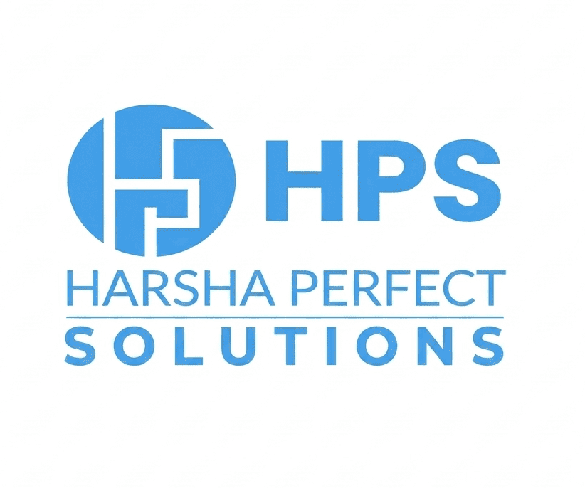

<div align="center">



# 🌐 Harsha Perfect Solutions — Official Website

[](https://react.dev)
[](https://www.typescriptlang.org)
[](https://vitejs.dev)
[](https://tailwindcss.com)
[](https://ui.shadcn.com)

**A modern, high-performance digital agency website built with React, TypeScript, and Tailwind CSS.**

[🔗 Live Website](https://www.thehps.in) &nbsp;·&nbsp; [📧 Contact](mailto:info@thehps.in) &nbsp;·&nbsp; [📸 Instagram](https://www.instagram.com/harsha_perfect_solutions)

---

</div>

## ✨ Overview

**Harsha Perfect Solutions Pvt Ltd** is a comprehensive digital solutions provider specializing in web design, app development, digital marketing, custom software, ERP solutions, and more. This repository contains the source code for our official company website — designed to showcase our expertise and connect with clients worldwide.

## 🖼️ Features

| Feature | Description |
|:---|:---|
| 🎨 **Modern UI/UX** | Clean, responsive design with smooth animations and micro-interactions |
| ⚡ **Blazing Fast** | Built on Vite for instant HMR and optimized production builds |
| 📱 **Fully Responsive** | Seamless experience across desktop, tablet, and mobile devices |
| 🧩 **Component Library** | Powered by shadcn/ui with Radix UI primitives for accessibility |
| 🔍 **SEO Optimized** | Proper meta tags, Open Graph, Twitter Cards, and semantic HTML |
| 🎭 **Dynamic Animations** | Scroll-triggered animations, rotating service icons, and carousel effects |
| 💬 **Floating Contact** | Interactive "Get in Touch" widget with integrated contact form |
| 🏢 **Client Showcase** | Infinite scrolling client logo carousel and case study cards |
| 📊 **Testimonials** | Auto-rotating testimonial slider with client photos and ratings |
| 🔗 **Social Sidebar** | Fixed social media quick-access panel (WhatsApp, Phone, Instagram) |

## 🛠️ Tech Stack

<div align="center">

| Layer | Technology |
|:---:|:---:|
| ⚛️ **Framework** | React 18 + TypeScript |
| 🏗️ **Build Tool** | Vite 5 |
| 🎨 **Styling** | Tailwind CSS 3.4 |
| 🧱 **UI Components** | shadcn/ui + Radix UI |
| 🧭 **Routing** | React Router DOM v6 |
| 📊 **Charts** | Recharts |
| 🔔 **Notifications** | Sonner Toast |
| 📝 **Forms** | React Hook Form + Zod |
| 🔄 **State** | TanStack React Query |

</div>

## 📁 Project Structure

```
HpsNew/
├── public/                  # Static assets (logos, client images, favicons)
│   ├── HPS_logo.png         # Primary logo
│   ├── client-logos/         # Client brand logos
│   ├── client_case_study/    # Case study images
│   └── testimonials/         # Testimonial photos
├── src/
│   ├── assets/              # Imported assets (hero, contact images)
│   ├── components/          # Reusable React components
│   │   ├── ui/              # shadcn/ui base components
│   │   ├── Header.tsx       # Navigation with dropdown menus
│   │   ├── Hero.tsx         # Hero section with animated icons
│   │   ├── Services.tsx     # Services grid with hover effects
│   │   ├── Process.tsx      # Animated process steps
│   │   ├── Testimonials.tsx # Testimonial carousel
│   │   ├── OurClients.tsx   # Client showcase + logo carousel
│   │   ├── Footer.tsx       # Footer with contact info
│   │   └── FloatingContact.tsx  # Floating contact widget
│   ├── pages/               # Route-level page components
│   │   ├── Index.tsx        # Home page
│   │   ├── Services.tsx     # All services page
│   │   ├── Portfolio.tsx    # Portfolio & case studies
│   │   ├── Contact.tsx      # Contact form page
│   │   ├── Careers.tsx      # Careers page
│   │   └── WebDesign.tsx    # Web design detail page
│   ├── hooks/               # Custom React hooks
│   ├── lib/                 # Utility functions
│   ├── App.tsx              # Root component with routing
│   ├── main.tsx             # Entry point
│   └── index.css            # Global styles & CSS variables
├── index.html               # HTML template with SEO meta tags
├── tailwind.config.ts       # Tailwind configuration
├── vite.config.ts           # Vite configuration
└── package.json             # Dependencies & scripts
```

## 🚀 Getting Started

### Prerequisites

- **Node.js** ≥ 18.x
- **npm** ≥ 9.x

### Installation

```bash
# Clone the repository
git clone https://github.com/Aswinsaipalakonda/HPS_Website.git

# Navigate to the project
cd HPS_Website

# Install dependencies
npm install

# Start the development server
npm run dev
```

The app will be available at **`http://localhost:5173`**

### Build for Production

```bash
# Create optimized production build
npm run build

# Preview the production build
npm run preview
```

## 📄 Available Scripts

| Command | Description |
|:---|:---|
| `npm run dev` | Start development server with HMR |
| `npm run build` | Build for production |
| `npm run preview` | Preview production build locally |
| `npm run lint` | Run ESLint for code quality checks |

## 🌍 Our Services

<div align="center">

| | Service | Description |
|:---:|:---|:---|
| 🖥️ | **Website Design** | Modern, user-first websites that drive results |
| 🎓 | **EduSuite Pro** | All-in-one educational institution management |
| 📈 | **Digital Marketing** | Targeted campaigns for visibility & growth |
| 📱 | **App Development** | Native iOS & Android mobile applications |
| 🎨 | **UI/UX Design** | Intuitive, user-centered interface design |
| 💻 | **Custom Software** | Scalable solutions tailored to your needs |
| ⚡ | **Automation** | Eliminate repetitive tasks, boost productivity |
| 🗄️ | **ERP Solutions** | Integrate and streamline business processes |

</div>

## 📬 Contact

<div align="center">

| | Channel | Details |
|:---:|:---|:---|
| 🌐 | **Website** | [www.thehps.in](https://www.thehps.in) |
| 📧 | **Email** | [info@thehps.in](mailto:info@thehps.in) |
| 📞 | **Phone** | [+91 9246615251](tel:+919246615251) |
| 📍 | **Address** | 31-7-67, Assam Gardens, Visakhapatnam, AP 530004 |
| 📸 | **Instagram** | [@harsha_perfect_solutions](https://www.instagram.com/harsha_perfect_solutions) |
| 💬 | **WhatsApp** | [Chat with us](https://wa.me/+919246615251) |

</div>

---

<div align="center">

**Built with ❤️ by [Harsha Perfect Solutions Pvt Ltd](https://www.thehps.in)**

© 2025 HPS Pvt Ltd. All rights reserved.

</div>
